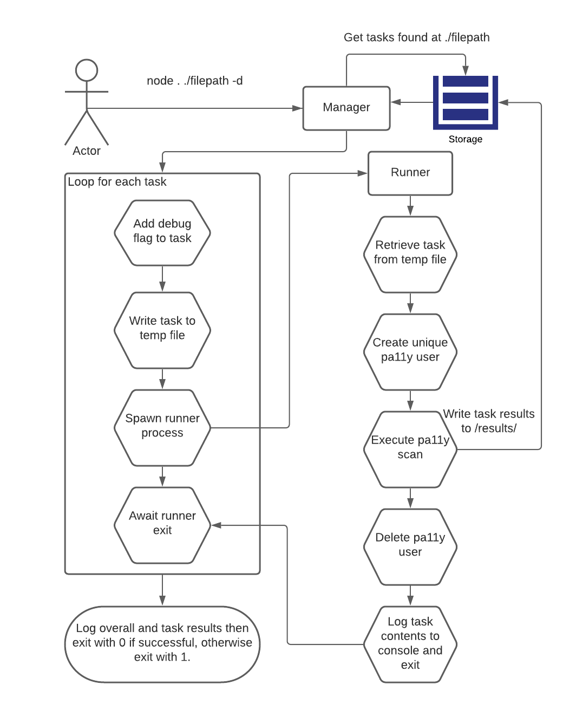

# Pa11y Manual
This document gets into the technicals of how the pa11y application works. 
It's written around an open-source project by the same name and requires Node.js +8 to run.
You can find that project's official documentation [here](https://github.com/pa11y/pa11y).

#### Forked pa11y repo
The standard open-source pa11y repo does not include the "wait" action.
The forked repo is found [here](https://github.com/devin-w-hill/pa11y).
Aside from the addition of the wait action, the fork is identical to pa11y 5.3.1.

## Architecture
Pa11y is separated into a "manager" process and "runner" processes. The manager handles the spawning of
runner processes, error handling, logging scan results, and determining the overall success of a run. 
The runner processes are spawned off to execute a single pa11y task and return success/failure to the manager.  
The manager writes temporary JSON files with one task each for the runner to retrieve and execute. The tasks are given unique filenames 
and the manager passes the task's file path to the runner as a command line argument.  
The runner communicates its success or failure through the console log and errors. Runners that can begin their scan 
procedure will log their task's contents to the console. When they exit, this is picked up in the manager's callback
for the runner where the task is parsed from a JSON string and any errors are handled.

### Manager
The manager logic is found in Pa11yCli.js. The entrypoint is in bin/index.js.
#### `setUp`
setUp() sets manager properties according to the file path and run options found in the command line to execute pa11y.
At minimum, a path to find pa11y tasks at is required.  
Run options:
+ -d: Sets debug flag. The manager will set this flag for all tasks unless the task already has it set. When the task is
executed in the runner, it will open a Chromium browser window so users can see the task take place. The window will remain
  open until the user manually closes it at which time the runner process can return its success/failure to the manager.
+ -t: Sets the maximum number of runner processes that can be running concurrently. The default is 4. The maximum number of
threads allowed should be tailored to the number of CPU cores available for pa11y to use. Too many processes running 
  concurrently can cause unexpected timeouts because tasks have to wait longer for time in the CPU. (ex: -t 15)
+ -r: Enables task retries. When a task fails, it will be re-run one time.

#### `run`
run() contains the main logic of the manager and all other execution branches from there.  
+ The file path provided will be used to determine which tasks will be run. 
+ Each task is passed off to execRunner() to spawn a runner process. execRunner() creates a new promise
  per task and pushes it to an array. Each promise resolves when its runner exits.
+ If retries are enabled, the above step repeats with each failed task. 
+ When all promises have resolved, the task results are then output to the console and overall success/failure of the pa11y
run is determined. 
+ If all tasks run (with retry success overriding a previous failure), then the pa11y run passed and
the manager process exits with code 0. Otherwise, it exits with code 1.

#### `prepareTasks`
This is where a task is written as a temp file for a runner to use later.  
+ If the debug option is set, it's added to the task if the task does not have it set already. 
+ The global timeout is also added to the task. 
+ The task is written to a temp file. Filenames use the task name and a timestamp so each is unique.

#### `execRunner`
This spawns off a new runner process to run a pa11y scan. 
+ Check if current number of runners is less than maximum allowed. If not, wait until a runner exits to proceed.
+ A new runner is spawned with command `"npm run --silent runner" + filePath` (filePath is the location of the temp 
task file). 
+ Create promise and add to an array so run() can await all processes to finish. 
+ On runner exit: 
  + The temp task file is deleted. 
  + Execution is passed off to childCallback(). 
  + Resolve promise.  

Note: to avoid collisions on temp file names, a 1ms delay between runner spawns
is used to help make timestamps unique.

#### `childCallback`
This is where the results of a runner are captured and the manager determines its success or failure. The runner process
returns any errors thrown and its stdout buffer.
+ Check if the runner exited because of an error. 
  + If runner exited because of an error, determine which kind, set task.success to false, log failure to console.
    + If error.signal is set to "SIGTERM", the runner exited due to timeout.
      + Task that was originally given to runner is pushed to an array based on if task was retry.
      + Log error to console.
    + If error.code is 2, the runner exited because it could not initialize.
      + Task that was originally given to runner is pushed to an array based on if task was retry.
      + Log error to console.
    + If error.code is 1, the runner threw an error while trying to do the pa11y scan.
      + Parse task from stdout and push to an array based on if task was retry.
      + Log error to console.
  + If runner had no error, set task.success to true, log success to console.
    + Parse task from stdout and push to an array based on if task was retry.  
  
Note: task.success does not imply anything about pa11y finding ADA issues or not. It only
      connotes that the task exited with an error of some kind.
      
#### `logOverallResults`
This logs how many tasks passed and failed overall with any retries logged separately.  
+ Sort tasks so those with errors or ADA issues are at the end of the array. This makes it easier to find
  those tasks when the individual tasks are logged.
+ Call logTaskResults() to log individual task details.
+ If any retry tasks were run, repeat the above steps.

#### `logTaskResults`
Details about each task are logged including success or failure and the causing errors or ADA issues.  
+ Check if task had any errors or ADA issues. 
  + If no errors or ADA issues, log one-liner stating success.
  + If errors or ADA issues, log failure and as much information provided in task as possible. The information to
  log depends on when an error occurred in the runner and caused it to exit.

#### `end`
Called from Pa11yCli.js. If run() determined the pa11y run overall was successful, this exits the manager process with
exit code 0. If there are any failed tasks or an error occurred in the manager, the manager process exits with exit code 1.

### Runner
The runner logic is mainly found in Runner.js. The entrypoint is in InitRunner.js.

#### `InitRunner`
The entrypoint for runner processes. When execRunner executes its "npm run..." command, the spawned process starts here.  
+ Filepath from the command is pulled from the argument array
+ New Runner object is instantiated then passed the file path to prepare its task.
  + If Runner instantiation or preparation of the task fails, the process will exit with code 2.  
+ InitRunner calls Runner.scan(). 
  + If an error is thrown during scan(), the process exits with code 1. 
  + If no errors, the process exits with code 0.

#### `prepareTask`
This prepares the task for the pa11y scan.  
+ Retrieves the task from the temp file. 

#### `scan`
This contains the main logic of the runner process.  
+ A database connection is opened. ***Not enabled***
+ A unique pa11y user is created for the task. ***Not enabled***
+ call setUpTaskOptions() which returns a puppeteer browser for pa11y to scan the task's url. 
+ The pa11y scan is started. 
  + On success, pa11y results are added to the task and written as HTML to the results directory.
  + On failure, no pa11y results are generated. For debugging purposes, a screenshot is taken of the browser page when the error was thrown.
+ The pa11y user is deleted from the database. ***Not enabled***
+ The database connection is ended. ***Not enabled***  
Note: Errors thrown at any point during `scan` will stop the runner and cause it to exit with code 1.

#### `setupTaskOptions`
+ Launches a puppeteer browser
  + If debug is set, browser will run in headful mode. Otherwise, it's headless.
+ If the task has autoLogin set, getLoginCookie() is called. ***Not enabled***
+ The browser and the task are returned.

#### `getLoginCookie` ***Not enabled***
Logs in so it does not have to be coded in the task's actions. Returns the cookie from the session
for use in pa11y scan.

